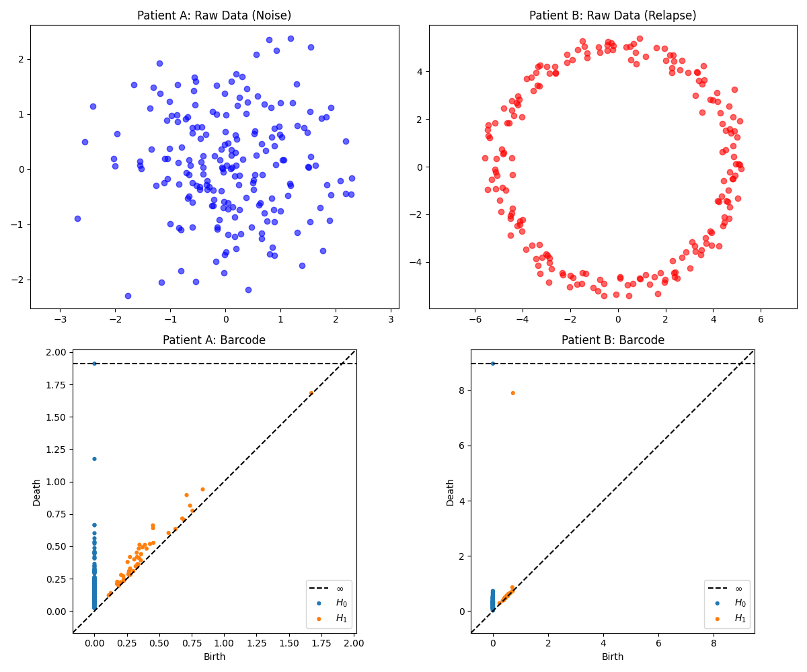

# Detection of Tumor Micrometastases using TDA 

## Project Objective
This script demonstrates the application of Topological Data Analysis (TDA) for the automated detection of tumor fragmentation and micrometastases based on 2D tissue scans (point clouds).

## Methodology (Algebraic Topology)
Instead of relying on complex geometric pattern recognition, the algorithm leverages the **Vietoris-Rips Complex** to analyze connected components, specifically the **$H_0$** homology class. 
* Synthetic data was generated to simulate two clinical scenarios:
  * **Patient A:** A solid, cohesive tumor (a single, dense point cloud).
  * **Patient B:** A fragmented tumor (main focus + 3 distant micrometastases).
* The `ripser` library was utilized to compute and visualize Persistence Diagrams.

## Results and Interpretation

The analysis of persistence diagrams for the $H_0$ class (blue dots) clearly differentiates the two cases:

1. **Patient A (Solid Tumor):** The vast majority of points (cells) merge into a single structure very early on (topological noise near the X-axis). There are no outlier points separated from the main cluster.
2. **Patient B (Metastases):** On the Y-axis (Death), we can clearly observe **three distinct $H_0$ points separated by a drastic "eigen-gap"** from the initial noise. Mathematically, this indicates that the Rips complex had to increase its scanning radius by a massive margin to connect these 3 isolated islands to the main tumor mass. This serves as topological proof of the existence of 3 separate micrometastases.

## Conclusions
Topological Data Analysis allows for the instant reduction of thousands of cells on a medical scan into single, easily interpretable features on a persistence diagram. Unlike classical visual inspection methods, TDA is fundamentally invariant to translations, rotations, and minor noise in spatial data.
# Detecting Tumor Relapse Dynamics with TDA 

## Project Objective
This project explores the use of Topological Data Analysis (TDA) to differentiate between a stable biological state and a cyclical tumor relapse. By analyzing the phase space of simulated clinical data, the script translates temporal dynamics into spatial geometry, allowing for the mathematical detection of periodic attractors.

## Methodology
The algorithm analyzes 2D phase portraits using the **Vietoris-Rips Complex**, with a specific focus on the **$H_1$** homology class (topological loops/cycles).
* Data was generated for 200 time steps ($N=200$) for two cases:
  * **Patient A:** A stable state represented by 2D Gaussian noise.
  * **Patient B:** A cyclical relapse represented by a noisy circle (radius $R=5$), reflecting periodic fluctuations in tumor mass or biomarker levels.
* The `ripser` library was used to compute the persistence diagrams.

## Results and Interpretation

The $H_1$ persistence diagrams (orange dots) provide a clear topological diagnosis:

1. **Patient A (Stable Noise):** All $H_1$ features are born and die almost immediately, hugging the diagonal line. This indicates a pure noise profile with no underlying cyclical dynamics.
2. **Patient B (Cyclical Relapse):** A single, prominent $H_1$ point is visible high above the diagonal. This point is born early and dies very late, representing the massive, robust cycle of the noisy circle. This "persistent" feature is the mathematical fingerprint of a recurring biological cycle (relapse).

## Conclusions
While classical time-series graphs can be noisy and difficult to interpret, mapping the data into a phase portrait and applying TDA reveals the hidden geometry of the disease. The presence of a highly persistent $H_1$ feature serves as an automated, robust indicator of cyclical relapse dynamics.
